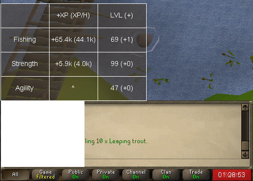

# Otto's Grotto Fisher

A OSBot barbarian fishing script.
Start with bait/feathers + barbarian fishing rod (or pearl variant)

### Features:

* ~20k-55k fishing xph, ~2.5-5.5k strength and agility xph. (Lvl Based)
* random inventory shift click drop orders.
* AFK simulation: Mouse offscreen/random AFKs if inventory is full or if the fishing spot moved.
* Dragon Harpoon special (If equipped)
* Saves Clue bottles
* stops on feather/bait shortage

### Requirements:

* Barbarian fishing unlocked! 58 fishing, 15 agility, and 35 strength + unlocked barbarian rod.

### Paint: 

